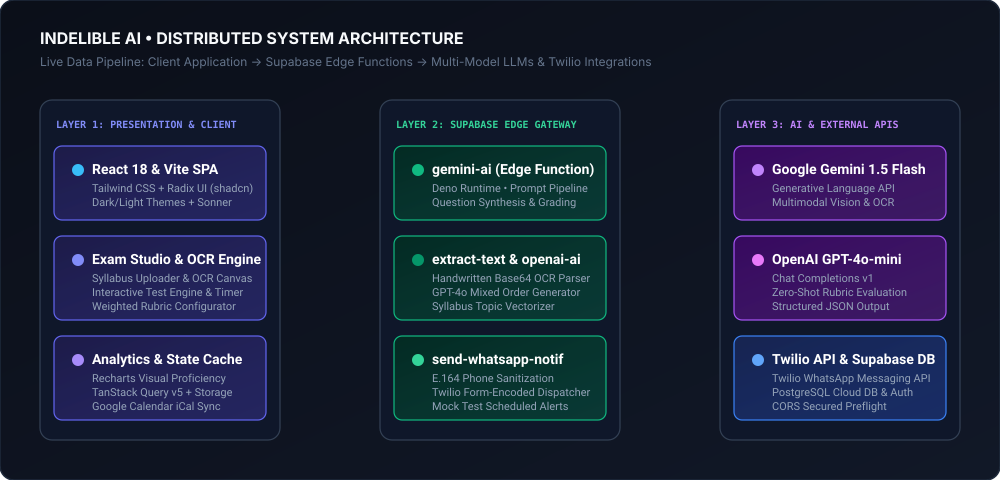

<div align="center">

  <!-- Animated Header Banner -->
  <a href="https://github.com/mohammadzaieemkhan/IndelibeAI">
    
  </a>

  <br/><br/>

  <!-- Dynamic Typing Subtitle -->
  <a href="https://github.com/mohammadzaieemkhan/IndelibeAI">
    
  </a>

  <p align="center">
    <strong>An autonomous AI-powered exam studio and personalized assessment engine designed for students and educators.</strong>
  </p>

  <!-- Badges Grid -->
  <p align="center">
    <a href="https://react.dev/"></a>
    <a href="https://www.typescriptlang.org/"></a>
    <a href="https://vitejs.dev/"></a>
    <a href="https://tailwindcss.com/"></a>
    <a href="https://supabase.com/"></a>
    <a href="https://ai.google.dev/"></a>
    <a href="https://openai.com/"></a>
    <a href="https://www.twilio.com/"></a>
  </p>

  <p align="center">
    <a href="#-interactive-system-architecture">Explore Architecture</a> •
    <a href="#-key-features">Key Features</a> •
    <a href="#-getting-started">Quick Start</a> •
    <a href="#-environment-configuration">Configuration</a> •
    <a href="#-project-structure">Project Structure</a>
  </p>

</div>

---

## 📖 Table of Contents

- [Executive Overview](#-executive-overview)
- [Key Features](#-key-features)
- [Interactive System Architecture](#-interactive-system-architecture)
  - [Visual Flow Diagram](#1-visual-flow-diagram)
  - [Interactive Component Flowchart (Mermaid)](#2-interactive-component-flowchart-mermaid)
  - [End-to-End Exam Lifecycle (Sequence Diagram)](#3-end-to-end-exam-lifecycle-sequence-diagram)
  - [Interactive Layer Drill-Downs](#4-interactive-layer-drill-downs)
- [AI Engine & Prompt Engineering](#-ai-engine--prompt-engineering)
- [Data Flow & API Matrix](#-data-flow--api-matrix)
- [Project Structure](#-project-structure)
- [Getting Started](#-getting-started)
- [Environment Configuration](#-environment-configuration)
- [Edge Functions Deployment](#-edge-functions-deployment)
- [Contributing & License](#-contributing--license)

---

## ⚡ Executive Overview

**Indelible AI** bridges the gap between study materials and exam mastery. Traditional exam preparation is time-consuming, fragmented, and disconnected from personalized evaluation. Indelible AI automates the entire assessment pipeline:

1. **Upload or Capture**: Upload official syllabi (PDF, DOCX, TXT) or take photos of handwritten notes.
2. **Intelligent Parsing**: Multimodal Vision OCR and LLM-driven topic vectorization synthesize structured topics and sub-competencies in seconds.
3. **Custom Exam Synthesis**: Generate customized tests across multiple formats (MCQ, Short Answer, Essay, True/False) with configurable difficulty levels and granular point distributions.
4. **Interactive Arena**: Sit for tests in a distraction-free environment complete with active timers, question jumpers, and auto-submission guards.
5. **Precision AI Grading**: Receive instant, rubric-backed grading with detailed constructive feedback, correct answer reveals, and topic-by-topic proficiency scores.
6. **Retention & Reminders**: Schedule upcoming mock exams with automated WhatsApp notifications and Google Calendar sync.

---

## ✨ Key Features

<table>
  <tr>
    <td width="50%">
      <h3>🧠 Dual-Core AI Model Engine</h3>
      Seamlessly switch between <strong>Google Gemini 1.5 Flash</strong> for lightning-fast multimodal OCR and <strong>OpenAI GPT-4o-mini</strong> for nuanced rubric evaluation. Built-in fallback resilience guarantees continuous uptime.
    </td>
    <td width="50%">
      <h3>📸 Multimodal Syllabus OCR</h3>
      Built-in support for digital course guides as well as raw photos of handwritten lecture notes. Gemini Vision handles OCR text extraction and automatically extracts modular topics.
    </td>
  </tr>
  <tr>
    <td width="50%">
      <h3>📝 Granular Question Synthesis</h3>
      Configure mixed-mode exams combining:
      <ul>
        <li><strong>MCQs</strong> with formatted single-answer choices</li>
        <li><strong>Short Answer</strong> with target answer lengths</li>
        <li><strong>Essay Prompts</strong> with word count guidance</li>
        <li><strong>True / False</strong> verification</li>
      </ul>
    </td>
    <td width="50%">
      <h3>🎯 Automated Evaluator &amp; Rubrics</h3>
      Answers undergo deep analytical grading. The AI produces granular scores against custom weights, calculates topic percentages, and details constructive feedback per item.
    </td>
  </tr>
  <tr>
    <td width="50%">
      <h3>📲 WhatsApp Alerts &amp; Scheduling</h3>
      Integrates directly with the <strong>Twilio WhatsApp API</strong> to dispatch automated reminders and exam schedules straight to student phones, backed by <code>.ics</code> Google Calendar export.
    </td>
    <td width="50%">
      <h3>📊 Performance Dashboards</h3>
      Powered by <strong>Recharts</strong>. Track long-term score trajectories, topic-level mastery rates, historical exam reviews, and pinpoint weak spots needing revision.
    </td>
  </tr>
</table>

---

## 🏛️ Interactive System Architecture

The Indelible AI platform is built as a cloud-native, reactive Single Page Application (SPA) supported by decoupled serverless edge functions and multimodal foundation models.

### 1. Visual Flow Diagram

<div align="center">
  
</div>

<br/>

### 2. Interactive Component Flowchart (Mermaid)

> 💡 *Tip: Nodes in this diagram reflect the actual workspace architecture. Click any highlighted node to jump to its corresponding implementation details below.*

```mermaid
flowchart TB
    %% Styling Classes
    classDef client fill:#1e1b4b,stroke:#6366f1,stroke-width:2px,color:#fff
    classDef edge fill:#022c22,stroke:#10b981,stroke-width:2px,color:#fff
    classDef ai fill:#3b0764,stroke:#c084fc,stroke-width:2px,color:#fff
    classDef comms fill:#1c1917,stroke:#f59e0b,stroke-width:2px,color:#fff
    classDef storage fill:#172554,stroke:#3b82f6,stroke-width:2px,color:#fff

    subgraph PRESENTATION["🖥️ Client Tier (React 18 + Vite)"]
        UI["App Layout & Router<br/>(src/App.tsx)"]:::client
        GEN_TAB["GenerateExamTab<br/>(src/components/tabs/)"]:::client
        UPLOADER["SyllabusUploader & OCR<br/>(src/components/)"]:::client
        EXAM_RUNNER["ExamRenderer & Engine<br/>(src/components/exam/)"]:::client
        CHARTS["Recharts Performance Analytics<br/>(src/components/PerformanceCharts.tsx)"]:::client
        STORE["State & LocalStorage Cache<br/>(upcomingExams, results)"]:::storage
    end

    subgraph MIDDLEWARE["⚡ Supabase Edge Runtime (Deno)"]
        CLIENT_PROXY["apiService.ts<br/>(Supabase Functions Client)"]:::edge
        FN_GEMINI["gemini-ai Edge Function<br/>(supabase/functions/gemini-ai)"]:::edge
        FN_OPENAI["openai-ai Edge Function<br/>(supabase/functions/openai-ai)"]:::edge
        FN_OCR["extract-text OCR Function<br/>(supabase/functions/extract-text)"]:::edge
        FN_TWILIO["send-whatsapp-notification<br/>(supabase/functions/send-whatsapp-notification)"]:::edge
    end

    subgraph PROVIDERS["🧠 AI Engines & External Cloud Services"]
        GEMINI_API["Google Generative AI<br/>Gemini 1.5 Flash"]:::ai
        OPENAI_API["OpenAI API<br/>GPT-4o-mini"]:::ai
        TWILIO_API["Twilio Programmable Messaging<br/>WhatsApp REST API"]:::comms
        SUPABASE_DB["Supabase Cloud<br/>PostgreSQL & Auth"]:::storage
    end

    %% Client Interactions
    UI --> GEN_TAB
    GEN_TAB --> UPLOADER
    GEN_TAB --> EXAM_RUNNER
    EXAM_RUNNER --> CHARTS
    EXAM_RUNNER --> STORE

    %% Client to Edge Middleware
    UPLOADER -->|Base64 Image Payload| CLIENT_PROXY
    GEN_TAB -->|Prompt & Syllabus Context| CLIENT_PROXY
    EXAM_RUNNER -->|Student Submission & Rubric| CLIENT_PROXY
    GEN_TAB -->|Phone & Schedule Alert| CLIENT_PROXY

    CLIENT_PROXY -->|POST /functions/v1/extract-text| FN_OCR
    CLIENT_PROXY -->|POST /functions/v1/gemini-ai| FN_GEMINI
    CLIENT_PROXY -->|POST /functions/v1/openai-ai| FN_OPENAI
    CLIENT_PROXY -->|POST /functions/v1/send-whatsapp-notification| FN_TWILIO

    %% Edge Functions to External Providers
    FN_OCR -->|Multimodal Vision API| GEMINI_API
    FN_GEMINI -->|Question Gen & Answer Grading| GEMINI_API
    FN_OPENAI -->|Structured Chat Completions| OPENAI_API
    FN_TWILIO -->|Form-Encoded WhatsApp Message| TWILIO_API
    CLIENT_PROXY -.->|JWT & Session Sync| SUPABASE_DB

    %% Return Data Flow
    GEMINI_API -->|Extracted Topics / Questions| FN_GEMINI
    OPENAI_API -->|Structured Questions / Scores| FN_OPENAI
    TWILIO_API -->|Message SID / Status| FN_TWILIO
    FN_GEMINI -->|JSON Response| CLIENT_PROXY
    FN_OPENAI -->|JSON Response| CLIENT_PROXY
    CLIENT_PROXY -->|Hydrate UI State| GEN_TAB
    CLIENT_PROXY -->|Render Exam / Results| EXAM_RUNNER
```



<br/>

### 3. End-to-End Exam Lifecycle (Sequence Diagram)

```mermaid
sequenceDiagram
    autonumber
    actor Student as 👤 Student / Educator
    participant Web as 💻 React Web App
    participant Edge as ⚡ Supabase Edge Function
    participant AI as 🧠 AI Model (Gemini / OpenAI)
    participant Twilio as 📲 Twilio WhatsApp API

    rect rgb(20, 25, 45)
    Note over Student, AI: Phase 1: Syllabus Upload & Topic Extraction
    Student->>Web: Uploads syllabus (PDF / Photo / Notes)
    Web->>Edge: POST /extract-text (Base64 file payload)
    Edge->>AI: Gemini 1.5 Vision OCR Request
    AI-->>Edge: Raw text stream & content
    Edge->>AI: Parse topics task
    AI-->>Edge: Normalized list of topic strings
    Edge-->>Web: Returns extracted topics array
    Web->>Student: Displays topics for configuration
    end

    rect rgb(25, 40, 30)
    Note over Student, AI: Phase 2: Exam Synthesis & Scheduling
    Student->>Web: Sets difficulty, question types & question count
    Student->>Web: (Optional) Adds test date & phone number
    Web->>Edge: POST /gemini-ai (task: "generate_questions")
    Edge->>AI: Structured prompt with MCQ ordering rules
    AI-->>Edge: Formatted questions & answer keys
    Edge-->>Web: Validated exam object
    opt Scheduled Alert Enabled
        Web->>Edge: POST /send-whatsapp-notification
        Edge->>Twilio: Dispatch formatted reminder
        Twilio-->>Student: 💬 WhatsApp notification with date & time
    end
    end

    rect rgb(45, 20, 45)
    Note over Student, AI: Phase 3: Live Assessment & Auto-Grading
    Student->>Web: Takes exam (live timer, question navigation)
    Student->>Web: Submits responses
    Web->>Edge: POST /gemini-ai (task: "evaluate_answer", examData)
    Edge->>AI: Deep evaluation rubric prompt
    AI-->>Edge: JSON { questionDetails, totalScore, topicPerformance }
    Edge-->>Web: Evaluation results
    Web->>Web: Cache to LocalStorage & Render Recharts analytics
    Web->>Student: Displays final grade, score breakdown & feedback
    end
```



<br/>

### 4. Interactive Layer Drill-Downs

Click each layer below to view its component architecture, APIs, and implementation specifications:

<details>
<summary><strong>🖥️ Layer 1: Presentation &amp; Client Application (SPA)</strong></summary>

<br/>

- **Framework**: React 18 with TypeScript compiled via Vite SWC plugin.
- **Routing**: `react-router-dom` with route protection and full layout wrappers:
  - `/` → `HomePage.tsx`: Hero banner, feature showcases, call to action.
  - `/dashboard` → `DashboardPage.tsx`: Main hub embedding `ExamTabs.tsx`.
  - `/profile` → `ProfilePage.tsx`: User stats, credentials, test logs.
  - `/about`, `/login`, `/signup`: Account management and contextual details.
- **Tab Architecture (`src/components/tabs/`)**:
  - `GenerateExamTab.tsx`: Configures topics, difficulty (`easy`, `medium`, `hard`), question distributions, AI engine toggle, and scheduling.
  - `UpcomingExamsTab.tsx`: Live count-down cards, delete/launch actions, and WhatsApp reminder triggers.
  - `PreviousExamsTab.tsx`: Historical archive of past test attempts with full question-level review.
  - `PerformanceTab.tsx`: Radar, bar, and area charts comparing topic masteries over time.
- **Exam Engine (`src/components/exam/`)**:
  - `ExamRenderer.tsx`: Handles dynamic question rendering, active timer countdown, option selection, bookmarking, and autosave.

</details>

<details>
<summary><strong>⚡ Layer 2: Supabase Edge Gateway &amp; Serverless Functions</strong></summary>

<br/>

Four decoupled edge functions running on the **Deno** runtime:

| Edge Function | Path | Target Task | Primary Provider |
| :--- | :--- | :--- | :--- |
| `gemini-ai` | `supabase/functions/gemini-ai/index.ts` | Question generation, answer grading, syllabus analysis | Google Gemini 1.5 Flash |
| `openai-ai` | `supabase/functions/openai-ai/index.ts` | Question generation, answer grading, fallback LLM | OpenAI GPT-4o-mini |
| `extract-text` | `supabase/functions/extract-text/index.ts` | Multimodal OCR on handwritten notes and images | Google Gemini Vision |
| `send-whatsapp-notification` | `supabase/functions/send-whatsapp-notification/index.ts` | E.164 phone sanitization & WhatsApp message dispatch | Twilio Messages API |

#### Sample Request Payload: Exam Generation
```json
{
  "task": "generate_questions",
  "topics": ["Quantum Mechanics", "Wave-Particle Duality"],
  "difficulty": "medium",
  "numberOfQuestions": 10,
  "questionTypes": ["mcq", "short_answer", "essay", "true_false"]
}
```

#### Sample Evaluation Response Payload
```json
{
  "questionDetails": [
    {
      "question": "What does Heisenberg's uncertainty principle establish?",
      "type": "mcq",
      "isCorrect": true,
      "feedback": "Correct! It defines the fundamental limit to precision between position and momentum.",
      "marksObtained": 2,
      "totalMarks": 2,
      "userAnswer": "A",
      "correctAnswer": "A"
    }
  ],
  "totalScore": 18,
  "totalPossible": 20,
  "percentage": 90,
  "topicPerformance": {
    "Quantum Mechanics": 92.5,
    "Wave-Particle Duality": 87.5
  }
}
```

</details>

<details>
<summary><strong>🧠 Layer 3: Dual AI Inference &amp; Evaluation Pipeline</strong></summary>

<br/>

- **Gemini 1.5 Flash (`generativelanguage.googleapis.com`)**:
  - Used for fast OCR inference (`temperature: 0.1`) on images up to 5MB.
  - Used for rapid exam generation and answer assessment with safety thresholds set to `BLOCK_ONLY_HIGH` for academic queries.
- **OpenAI GPT-4o-mini (`api.openai.com/v1/chat/completions`)**:
  - High-precision zero-shot grading and prompt evaluation (`temperature: 0.7`, `max_tokens: 4096`).
  - Structured output parsing guarantees JSON validity for question rubrics.
- **Mixed Order Distribution Guarantee**:
  - Enforces strict question sequencing for multi-format exams:
    1. Multiple Choice Questions (MCQ)
    2. Short Answer Questions
    3. Essay Prompts
    4. True / False Questions

</details>

<details>
<summary><strong>📲 Layer 4: Communications &amp; Notification Pipeline</strong></summary>

<br/>

- **Twilio WhatsApp Integration**:
  - Automated telephone normalization (automatically prefixes `whatsapp:+` and country codes).
  - Encoded payload dispatched to `https://api.twilio.com/2010-04-01/Accounts/{TWILIO_ACCOUNT_SID}/Messages.json`.
  - Dispatches scheduled mock exam time, duration, and subject alerts.
- **Calendar Synchronization**:
  - Generates RFC-compliant `.ics` calendar events.
  - Direct 1-click addition to Google Calendar, Apple Calendar, and Outlook.

</details>

<details>
<summary><strong>💾 Layer 5: Data Persistence &amp; Caching Strategy</strong></summary>

<br/>

- **Client Storage Keys**:
  - `upcomingExams`: Stores pending test definitions, question sets, and schedules.
  - `previousExams`: Historical submissions, student answers, and AI feedback.
  - `examResults`: Cumulative scores, topic mastery distributions, and grading metrics.
  - `userData`: Demo profile session and contact info.
  - `indelible-theme`: Active dark/light theme state (`dark` | `light` | `system`).
- **Cloud Backend**: Supabase PostgreSQL with configured CORS headers and JWT preflight handlers.

</details>

---

## 📊 Data Flow & API Matrix

| Pipeline Route | Method | Payload Input | Processing Time (Avg) | Fallback / Recovery |
| :--- | :--- | :--- | :--- | :--- |
| `extract-text` | `POST` | `imageBase64` string | ~1.2s - 2.5s | Returns client alert to upload plain text |
| `gemini-ai` (Gen) | `POST` | `topics`, `difficulty`, `count` | ~2.0s - 3.8s | Re-route to `openai-ai` |
| `gemini-ai` (Eval) | `POST` | `examData` + user answers | ~2.5s - 4.5s | Rule-based answer comparison fallback |
| `send-whatsapp-notif` | `POST` | `phoneNumber`, `message` | ~400ms - 800ms | Displays in-app toast reminder if unreachable |

---

## 📁 Project Structure

```text
IndelibeAI/
├── 📂 assets/                     # Animated SVGs, diagrams & visual badges
│   ├── banner.svg                 # Animated cyber gradient hero banner
│   └── architecture-diagram.svg   # Animated system architecture flow
├── 📂 public/                     # Static web assets & icons
├── 📂 src/                        # Core React 18 application source
│   ├── 📂 components/             # Reusable UI components & layouts
│   │   ├── 📂 exam/               # Exam test runner, cards & question renderers
│   │   ├── 📂 tabs/               # Dashboard tabs (Generate, Upcoming, History, Stats)
│   │   ├── 📂 ui/                 # Radix UI primitives styled with Tailwind CSS
│   │   ├── ExamTabs.tsx           # Tab coordinator & state manager
│   │   ├── Navbar.tsx             # Responsive navigation bar with theme toggle
│   │   ├── PerformanceCharts.tsx  # Recharts visual analytics component
│   │   ├── SyllabusUploader.tsx   # File uploader & multimodal OCR trigger
│   │   └── ThemeProvider.tsx      # Dark / light theme provider
│   ├── 📂 hooks/                  # Custom React hooks (useToast, etc.)
│   ├── 📂 integrations/           # Third-party client integrations
│   │   └── 📂 supabase/           # Supabase client singleton & types
│   ├── 📂 pages/                  # Page routes (Home, Dashboard, Profile, Login)
│   ├── 📂 utils/                  # API bridge (apiService.ts, PDF converters)
│   ├── App.tsx                    # Top-level React routing & QueryClient
│   ├── index.css                  # Tailwind styles & theme variables
│   └── main.tsx                   # React DOM entry point
├── 📂 supabase/                   # Supabase configuration & Edge Functions
│   └── 📂 functions/              # Deno Serverless Edge Functions
│       ├── 📂 extract-text/       # Gemini Vision OCR extraction
│       ├── 📂 gemini-ai/          # Gemini 1.5 Flash question synthesis & grading
│       ├── 📂 openai-ai/          # OpenAI GPT-4o-mini generation & grading
│       └── 📂 send-whatsapp-notification/ # Twilio WhatsApp messaging service
├── package.json                   # Dependencies & npm scripts
├── tailwind.config.ts             # Tailwind CSS tokens & color variables
├── vite.config.ts                 # Vite bundler configuration
└── README.md                      # Comprehensive project documentation
```

---

## 🚀 Getting Started

### Prerequisites

Ensure you have the following installed on your machine:
- **Node.js**: v18.0.0 or later ([Download Node](https://nodejs.org/))
- **npm** (bundled with Node) or **bun** / **pnpm**
- **Git**

### Installation

1. **Clone the repository:**
   ```bash
   git clone https://github.com/mohammadzaieemkhan/IndelibeAI.git
   cd IndelibeAI
   ```

2. **Install project dependencies:**
   ```bash
   npm install
   ```

3. **Configure Environment Variables:**
   Create a `.env` file in the root directory (see [Configuration](#-environment-configuration) below).

4. **Start the local development server:**
   ```bash
   npm run dev
   ```
   Open your browser and navigate to `http://localhost:8080` (or the port specified in terminal output).

5. **Build for production:**
   ```bash
   npm run build
   ```

---

## ⚙️ Environment Configuration

Create a `.env` file in the project root:

```env
# ==========================================
# Frontend Supabase Credentials
# ==========================================
VITE_SUPABASE_URL="https://<YOUR_PROJECT_ID>.supabase.co"
VITE_SUPABASE_ANON_KEY="<YOUR_SUPABASE_ANON_KEY>"

# ==========================================
# Supabase Edge Functions Secrets
# (Configured via `supabase secrets set`)
# ==========================================
GEMINI_API_KEY="<YOUR_GOOGLE_GEMINI_API_KEY>"
OPENAI_API_KEY="<YOUR_OPENAI_API_KEY>"
TWILIO_ACCOUNT_SID="<YOUR_TWILIO_ACCOUNT_SID>"
TWILIO_AUTH_TOKEN="<YOUR_TWILIO_AUTH_TOKEN>"
TWILIO_WHATSAPP_NUMBER="whatsapp:+14155238886"
```

> 🔐 **Security Note**: Never commit API keys or production secrets to Git.

---

## ☁️ Edge Functions Deployment

To deploy or update the serverless functions on your Supabase instance:

```bash
# 1. Login to Supabase CLI
npx supabase login

# 2. Link your local repository to your Supabase project
npx supabase link --project-ref <YOUR_PROJECT_REF>

# 3. Set Edge Function Secrets
npx supabase secrets set GEMINI_API_KEY="your-gemini-key"
npx supabase secrets set OPENAI_API_KEY="your-openai-key"
npx supabase secrets set TWILIO_ACCOUNT_SID="your-twilio-sid"
npx supabase secrets set TWILIO_AUTH_TOKEN="your-twilio-token"
npx supabase secrets set TWILIO_WHATSAPP_NUMBER="whatsapp:+14155238886"

# 4. Deploy all Edge Functions
npx supabase functions deploy extract-text --no-verify-jwt
npx supabase functions deploy gemini-ai --no-verify-jwt
npx supabase functions deploy openai-ai --no-verify-jwt
npx supabase functions deploy send-whatsapp-notification --no-verify-jwt
```

---

## 🤝 Contributing & License

Contributions make the open-source community an inspiring place to learn, create, and build. Any contributions you make are **greatly appreciated**.

1. Fork the Project
2. Create your Feature Branch (`git checkout -b feature/AmazingFeature`)
3. Commit your Changes (`git commit -m 'Add some AmazingFeature'`)
4. Push to the Branch (`git push origin feature/AmazingFeature`)
5. Open a Pull Request

Distributed under the **MIT License**. See `LICENSE` for more information.

<div align="center">
  <br/>
  <sub>Built with ❤️ by <a href="https://github.com/mohammadzaieemkhan">Mohammad Zaieem Khan</a> for students and educators worldwide.</sub>
</div>